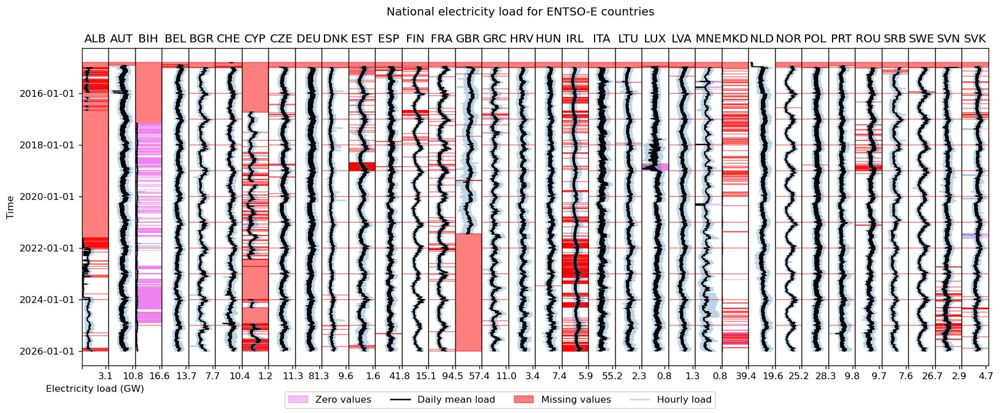

# Data module for electricity demand in Europe

This module prepares electricity demand timeseries for Europe at arbitrary resolution, based on ENTSO-E historical load data.

<!-- Place an attractive image of module outputs here -->

<p align="center">
  
</p>

## About
<!-- Please do not modify this templated section -->

This is a modular `snakemake` workflow created as part of the [Modelblocks project](https://www.modelblocks.org/). It can be imported directly into any `snakemake` workflow.

For more information, please consult the Modelblocks [documentation](https://modelblocks.readthedocs.io/en/latest/),
the [integration example](./tests/integration/Snakefile),
and the `snakemake` [documentation](https://snakemake.readthedocs.io/en/stable/snakefiles/modularization.html).

## Overview
<!-- Please describe the processing stages of this module here -->

Data processing steps:

- Download ENTSO-E historical load profiles.
- Download a gridded population dataset that serves as a disaggregation proxy.
- Filter and clean the raw load profile data.
- Clip the population raster to the ENTSO-E area.
- Disaggregate the national annual load to raster, using population as weight.
- Re-aggregate the annual load raster data to the target shapes.
- Assign the corresponding national load profile to each region to get the final load profiles for the target shapes.

## Configuration
<!-- Please describe how to configure this module below -->

Please consult the configuration [README](./config/README.md) and the [configuration example](./config/config.yaml) for a general overview on the configuration options of this module.

## Input / output structure
<!-- Please describe input / output file placement below -->

Please consult the [interface file](./INTERFACE.yaml) for more information.

## Development
<!-- Please do not modify this templated section -->

We use [`pixi`](https://pixi.sh/) as our package manager for development.
Once installed, run the following to clone this repository and install all dependencies.

```shell
git clone git@github.com:modelblocks-org/module_demand_electricity.git
cd module_demand_electricity
pixi install --all
```

Please be aware that this is a multi-environment project (see [pixi.toml](./pixi.toml) for details).
- `default`: used for development and integration testing.
Because it contains `Snakemake`, `conda` and `pytest` as dependencies it **should not be used** in `Snakemake` rules.
- `module`: contains minimal dependencies used in `Snakemake` rules.
If modified, be sure to export it to `Snakemake` so it can be recreated by module users:

```shell
# create module.yaml and conda-spec pin files in workflow/envs/
pixi run export-snakemake-env module
```


## Testing
<!-- Please do not modify this templated section -->

For testing, simply run:

```shell
pixi run test-integration
```

To test a minimal example of a workflow using this module:

```shell
pixi shell    # activate this project's environment
cd tests/integration/  # navigate to the integration example
snakemake --use-conda --cores 2  # run the workflow!
```

## References
<!-- Please provide thorough referencing below -->

This module is based on the following research and datasets:

* ENTSOE Transparency Platform (https://transparency.entsoe.eu)
* Open Power System Data (https://data.open-power-system-data.org)
* Schiavina M., Freire S., Carioli A., MacManus K. (2023):
  GHS-POP R2023A - GHS population grid multitemporal (1975-2030).European Commission, Joint Research Centre (JRC)
  PID: http://data.europa.eu/89h/2ff68a52-5b5b-4a22-8f40-c41da8332cfe, doi:10.2905/2FF68A52-5B5B-4A22-8F40-C41DA8332CFE

## Contributors ✨

Thanks goes to these wonderful people, sorted alphabetically ([emoji key](https://allcontributors.org/en/reference/emoji-key/)):

<!-- ALL-CONTRIBUTORS-LIST:START - Do not remove or modify this section -->
<!-- prettier-ignore-start -->
<!-- markdownlint-disable -->
<table>
  <tbody>
    <tr>
      <td align="center" valign="top" width="14.28%"><a href="https://github.com/jnnr"><br /><sub><b>Jann Launer</b></sub></a><br /><a href="#ideas-jnnr" title="Ideas, Planning, & Feedback">🤔</a> <a href="https://github.com/modelblocks-org/module_demand_electricity/commits?author=jnnr" title="Code">💻</a> <a href="https://github.com/modelblocks-org/module_demand_electricity/commits?author=jnnr" title="Tests">⚠️</a> <a href="https://github.com/modelblocks-org/module_demand_electricity/commits?author=jnnr" title="Documentation">📖</a></td>
     <td align="center" valign="top" width="14.28%"><a href="https://orcid.org/0000-0003-2288-6423"><br /><sub><b>Ivan Ruiz Manuel</b></sub></a><br /><a href="https://github.com/modelblocks-org/module_demand_electricity/pulls?q=is%3Apr+reviewed-by%3Airm-codebase" title="Reviewed Pull Requests">👀</a></td>
    </tr>
  </tbody>
</table>

<!-- markdownlint-restore -->
<!-- prettier-ignore-end -->

<!-- ALL-CONTRIBUTORS-LIST:END -->

This project follows the [all-contributors](https://github.com/all-contributors/all-contributors) specification. Contributions of any kind welcome!
